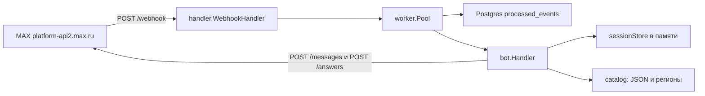
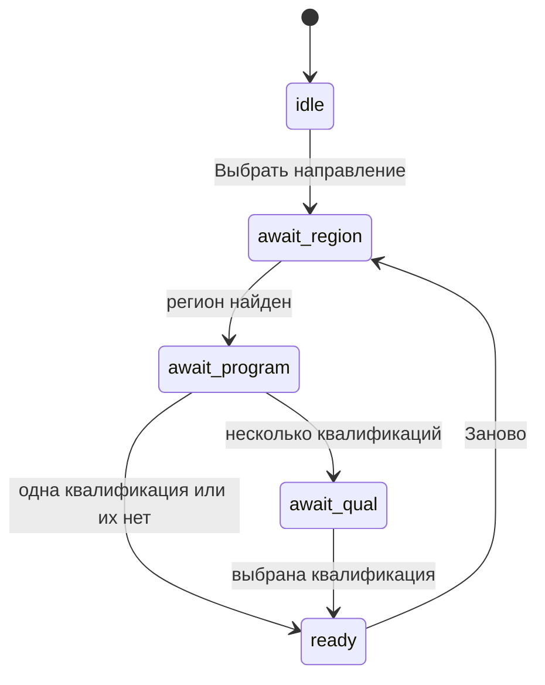
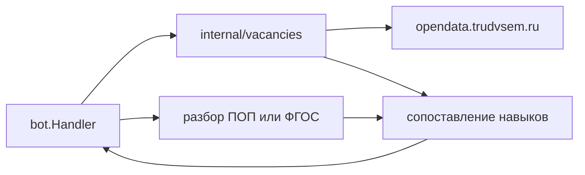

# Архитектура SkillGap

Один процесс Go 1.26. Пользователь общается с ботом в MAX. Отдельного мини-приложения и клиентского HTTP API нет.

Продуктовые правила — в `Техническое задание SkillGap 2.0.md` и `AGENTS.md`.

## Как устроено сейчас

Старт в `cmd/bot/main.go`:

1. Обязательны `DATABASE_URL`, `MAX_BOT_TOKEN`, `MAX_WEBHOOK_SECRET`. Пул Postgres: до 25 соединений, минимум 5.
2. Каталог СПО с диска (`SKILLGAP_CATALOG_PATH` или `spo_program_vacancy_map.json`).
3. `GET /me` — проверка токена. `PATCH /me/commands` — команды `start`, `help`, `skillgap`.
4. Если задан `MAX_WEBHOOK_URL` (только `https://`), `POST /subscriptions` на типы `bot_started`, `bot_added`, `bot_removed`, `bot_stopped`, `message_created`, `message_callback`.
5. 30 воркеров, очередь на 10 000 апдейтов. HTTP на `:8080`: `POST /webhook`, `GET /metrics`.

Вход webhook:

1. `WebhookSecretMiddleware` сравнивает `X-Max-Bot-Api-Secret` в константном времени. Пустой или неверный секрет — 401.
2. Тело декодируется в `maxapi.Update`. Очередь полна — 503, иначе 200 сразу, обработка идёт в воркере.
3. Воркер вставляет строку в `processed_events (chat_id, timestamp, update_type)`. Конфликт — повтор MAX, апдейт пропускается.
4. `bot.Handler` отвечает на `bot_started`, `message_created`, `message_callback`. `bot_added`, `bot_removed`, `bot_stopped` только логируются.

Таймаут обработки одного апдейта — 20 секунд. Клиент MAX: таймаут HTTP 15 секунд, до 3 попыток на сеть, 429 и 503. Глобальный лимит — 25 rps, на чат — 2 сообщения в секунду.

## Диалог

Сессия живёт в памяти процесса и ключуется по `chat_id`. Рестарт бота сессию сбрасывает. В Postgres диалог не пишется.

Шаги:

- Регион: кнопки `PopularRegions` или текст. Несколько совпадений — кнопки `sg:reg:{short}`.
- Программа: код или подстрока названия, до 8 результатов. Точный код важнее подстроки, `is_current` выше исторических. Выбор — `sg:p:{code}`.
- Квалификация: если их несколько, кнопки `sg:q:{index}`.
- На `ready` бот показывает стартовые должности (`RolesForQualification`), дисклеймер и ссылку на источник (`SourceURL`: ПОП, иначе ФГОС). Кнопка `sg:analyze` вызывает `analyzeStub` и сообщает, что вакансии ещё не подключены.

Сообщения с клавиатурой уходят через `POST /messages` (`chat_id` и при наличии `user_id` в query). Нажатие кнопки меняет то же сообщение через `POST /answers`.

## Данные

Postgres сейчас нужен только для дедупликации webhook.

Таблица `processed_events` (goose, `cmd/migrator`):

- `chat_id BIGINT`
- `timestamp BIGINT`
- `update_type VARCHAR(50)`
- первичный ключ `(chat_id, timestamp, update_type)`

Каталог СПО в базу не загружается. Файл `spo_program_vacancy_map.json`: ключ `programs` — код профессии или специальности. В записи — название, тип, УГПС, `is_current`, квалификации, `work_roles`, `vacancy_queries`, `active_standard` (реквизиты и ссылки ФГОС/ПОП). Поле `_documentation` в файле задаёт, что считается официальным фактом, а что поисковой моделью.

Регионы — код субъекта для «Работа России» в `internal/catalog/regions.go` (например `7700000000000` для Москвы, короткий код кнопки `77`).

## Развёртывание

Образ (`Dockerfile`): сборка `max-bot` и `migrator`, корневые сертификаты Минцифры, копия JSON-справочника.

`docker-compose.yml`:

- Postgres 17, volume `pgdata`.
- `migrator` один раз после здоровой БД.
- `app` слушает `127.0.0.1:8080` после успешной миграции.
- Prometheus снимает `app:8080` и себя (`prometheus.yml`). Grafana на порту 3000.

Сервис nginx в compose закомментирован. Файл `nginx.conf` проксирует HTTP на `app:8080` и TLS не завершает. Снаружи webhook MAX должен приходить на HTTPS порт 443 с доверенным сертификатом.

CI (`.github/workflows/ci.yml`): `task lint`, `task test`. На `main` и `master` после проверок — выкладка в `/opt/max-bot` и `docker compose up -d --build`.

`cmd/emulator` шлёт пачку `POST /webhook` и пять копий одного события. Это проверка очереди и идемпотентности, не сценарий SkillGap.

## Чего ещё нет относительно ТЗ

| Блок ТЗ | Сейчас |
|---|---|
| Регион, программа, квалификация, должности, ссылка на федеральный источник | Сообщения бота |
| Вакансии «Работа России», начальный уровень, ссылки, отметка тестовых данных | Нет, `analyzeStub` |
| Навыки рынка и частота | Нет |
| Дисциплины, модули, компетенции программы | Есть только ссылка ФГОС/ПОП |
| Skill Gap со статусом и подтверждающим фрагментом | Нет |
| Зарплатный диапазон, медиана, «Нет данных» | Нет |
| Источник, дата и режим live/cache/test | Нет |

`shared/api/openapi.yaml` (`/users/me`, `/bot/history`) не реализован и не описывает этот бот.

## Куда ложится остальное ТЗ

Тот же процесс и тот же диалог. Новый сервис и мини-приложение не нужны. Экраны ТЗ остаются сообщениями: направление (есть), результат, вакансии, программа.

Пакеты ниже в репозитории ещё не созданы.

`internal/vacancies` — адаптер открытых данных «Работа России»:

- базовый URL `https://opendata.trudvsem.ru/api/v1/vacancies`;
- шаблон из `_documentation.vacancy_pipeline` справочника: `/region/{region_code}?text={query}&experienceFrom=0&experienceTo=1`;
- запросы брать из `vacancy_queries` выбранной программы, регион — `session.RegionCode`;
- после ответа: дедуп, отсев senior/lead/руководитель/архитектор, опыт до 1 года, ссылка на исходную вакансию;
- у снимка хранить источник, `fetched_at` и режим `live`, `cache` или `test`. Тестовый режим в тексте для пользователя помечать явно.

Разбор программы и Skill Gap:

- сначала примерная программа (`active_standard.pop_url`), если её нет — ФГОС (`fgos_url`);
- из документа — дисциплины, профессиональные модули, компетенции и навыки;
- навык вакансии получает один статус: найдено, частично найдено, не найдено в анализируемом документе;
- при совпадении рядом — дисциплина, модуль или фрагмент и ссылка на документ;
- формулировка не должна утверждать, что колледж навык не преподаёт.

Зарплаты считаются по тем же вакансиям: диапазон, медиана при достаточных данных, число вакансий в расчёте. Если сумм нет — «Нет данных».

`bot.Handler` на `sg:analyze` вызывает эти пакеты и раскладывает ответ по сообщениям. Поиск вакансий и разбор документа в handler не писать.
