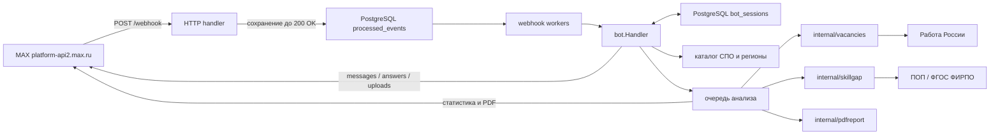
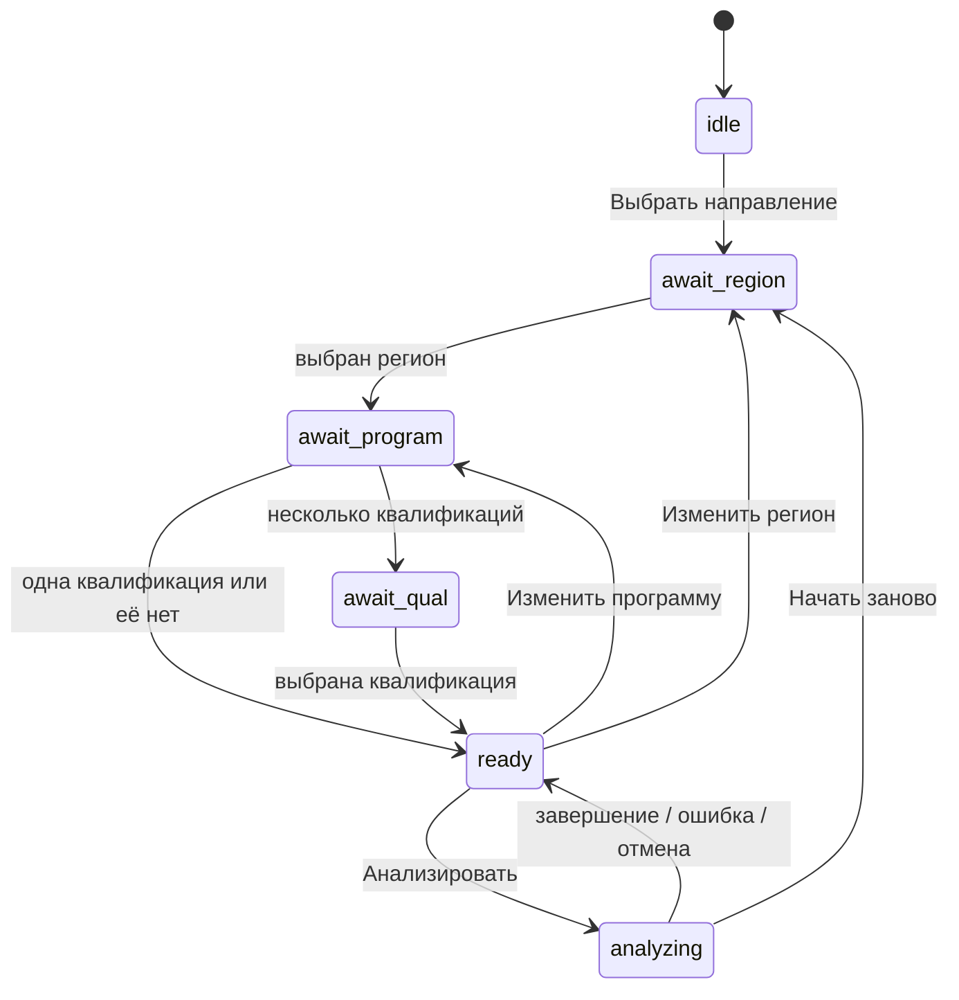

# Архитектура SkillGap

SkillGap — бот в MAX для девятиклассников, которые уже рассматривают программы СПО. Он показывает возможные стартовые должности, анализирует вакансии «Работы России» и сопоставляет навыки рынка с федеральной примерной образовательной программой или ФГОС.

Бот не выбирает профессию, не гарантирует трудоустройство и не оценивает учебный план конкретного колледжа. Продуктовые ограничения зафиксированы в `Техническое задание SkillGap 2.0.md` и `AGENTS.md`.

## Контур приложения

В production работают один Go-процесс, мигратор и PostgreSQL. Prometheus и Grafana подключаются отдельным Compose-профилем `observability`.

Старт в `cmd/bot/main.go`:

1. Проверяются `DATABASE_URL`, `MAX_BOT_TOKEN` и `MAX_WEBHOOK_SECRET`, открывается пул PostgreSQL.
2. Загружается и валидируется JSON-каталог СПО. Политика доступных программ задаётся `SKILLGAP_CATALOG_POLICY`.
3. Создаются клиенты MAX и «Работы России», анализатор образовательных документов, PDF-генератор и обработчик диалога.
4. Через `GET /me` проверяется токен, затем регистрируются команды `start`, `help`, `skillgap`, `privacy`, `forget`.
5. Если задан `MAX_WEBHOOK_URL`, приложение оформляет HTTPS-подписку MAX при старте и периодически подтверждает её повторно; интервал задаётся `MAX_WEBHOOK_RECONCILE_INTERVAL`.
6. Запускаются воркеры надёжной очереди webhook, отдельный ограниченный пул анализа и HTTP-сервер на `:8080`.

Живые маршруты:

- `POST /webhook` — webhook MAX с проверкой `X-Max-Bot-Api-Secret`;
- `GET /healthz` — liveness процесса;
- `GET /readyz` — готовность PostgreSQL и очереди принимать события;
- `GET /metrics` — технические и продуктовые метрики Prometheus.

Отдельного клиентского REST API нет. Удалённый `shared/api/openapi.yaml` описывал несуществующий контур и больше не используется.

## Надёжная обработка webhook

Webhook подтверждается только после сохранения события в PostgreSQL:

1. middleware сравнивает секрет в константном времени;
2. тело ограничивается `MAX_WEBHOOK_MAX_BODY_BYTES` и декодируется в `maxapi.Update`;
3. стабильный `event_key` строится из `callback_id`, `message_id` или SHA-256 всего события;
4. событие атомарно записывается в `processed_events` со статусом `received`;
5. только после успешной записи MAX получает `200 OK`; ошибка хранилища даёт `503`, а переполнение памяти не теряет событие — его позже подберёт recovery;
6. воркер берёт событие, переводит его в `processing`, вызывает `bot.Handler`, затем ставит `completed` либо `failed` с отложенной повторной попыткой; ошибка доставки сообщения из обработчика также считается ошибкой события.

События одного `chat_id` сериализуются advisory lock PostgreSQL и строгим порядком по идентификатору, поэтому более новое событие не обходит старое даже во время его backoff. Фоновое восстановление подхватывает необработанные, ошибочные и зависшие события после рестарта. После восьми неуспешных попыток событие переводится в `dead`, чтобы повреждённый payload или постоянная ошибка не создавали бесконечный цикл. После успешной обработки исходный webhook-payload очищается; завершённые записи хранятся 30 дней, окончательно неуспешные — 7 дней по умолчанию.

Схема `processed_events` сохраняет старый составной primary key для совместимости с предыдущей версией при безопасном откате, но новая идемпотентность опирается на уникальный `event_key`. Если два разных события имеют одинаковые старые поля, второе получает детерминированное служебное значение, а порядок всё равно задаётся исходным `event_timestamp`. Down-миграция отказывается удалять durable-поля, пока есть незавершённые события.

## Диалог и сессия

Состояние ключуется по `chat_id`, кэшируется в процессе и сохраняется в `bot_sessions`. TTL по умолчанию — 24 часа. `/forget` удаляет запись сразу; фоновая очистка удаляет истёкшие записи. История сообщений, тексты вакансий и сформированные PDF в таблице не хранятся.

Особенности сценария:

- поиск программы принимает точный код или часть названия; точный код и актуальные программы ранжируются выше;
- найденные программы показываются страницами, а не обрезаются первыми восемью;
- пользователь может вернуться к региону или программе, отменить анализ и повторить его после ошибки;
- кнопка «Начать заново» добавляется к актуальным сообщениям;
- после результата доступны оценка полезности и прямые ссылки на несколько наиболее релевантных вакансий;
- `/privacy` объясняет обработку данных, `/forget` удаляет сохранённый выбор.

Смена выбора увеличивает `generation`; завершившийся старый анализ проверяет её перед отправкой и не публикует устаревший результат. После рестарта выбранные регион, программа и квалификация восстанавливаются. Само выполнявшееся задание анализа пока не сохраняется: состояние возвращается в `ready` с признаком прерывания, поэтому бот прямо сообщает о рестарте и предлагает безопасно запустить анализ повторно; старая кнопка отмены не выдаёт ложное подтверждение завершения.

Callback-префиксы: `sg:begin`, `sg:help`, `sg:restart`, `sg:reg:`, `sg:p:`, `sg:q:`, `sg:more:`, `sg:change:program`, `sg:change:region`, `sg:analyze:`, `sg:cancel:`, `sg:feedback:`.

## Каталог СПО

`spo_program_vacancy_map.json` связывает код программы с квалификациями, поисковыми ролями и запросами вакансий. Официальными фактами считаются код, название, квалификации и реквизиты ФГОС/ПОП. `work_roles` и `vacancy_queries` — внутренняя поисковая модель; пользователю она показывается только как возможные направления с дисклеймером.

При загрузке проверяются версия схемы, уникальность и формат кодов, квалификации, ссылки HTTPS, согласованность запросов, статусы ручной проверки и наличие федерального источника. JSON Schema находится в `schemas/`.

Политики выдачи:

- `all` — все записи; непроверенные поисковые модели явно помечаются как предварительные;
- `current` — только актуальные программы;
- `pilot` — только актуальные записи с вручную проверенной поисковой моделью.

Production-конфигурация по умолчанию использует `pilot`. Неизвестное значение политики также закрывается до пилотного набора; расширение до `current` или `all` требует явной настройки.

Для анализа используется только утверждённая ПОП. Проект или неутверждённый документ пропускается; резервным источником служит действующий ФГОС.

## Анализ вакансий

`internal/vacancies` выполняет ограниченные запросы к `https://opendata.trudvsem.ru/api/v1/vacancies`, нормализует ответы и формирует единый снимок.

Последовательность выборки:

1. запросы из выбранной поисковой модели выполняются с ограничением RPS, параллельности, страниц, размера ответа и общего таймаута;
2. вакансии дедуплицируются;
3. сначала исключаются нерелевантные отрасли и вакансии, требующие высшего образования, затем senior/lead/руководящие позиции и другие hard negatives;
4. оставшиеся вакансии получают score релевантности и сортируются;
5. навыки извлекаются из структурированных полей и текста самой вакансии, нормализуются и сохраняют подтверждающие фрагменты;
6. результат ограничивается прозрачными лимитами, а пользователю показываются размеры каждого этапа выборки.

Опыт разделяется на «без опыта», «до года» и «не указан». Зарплата считается только в доминирующей валюте, диапазон переводится в середину. Медиана и диапазон публикуются при не менее чем пяти вакансиях с зарплатой; иначе выводится «Нет данных». Вместе с результатом всегда сохраняются источник, время и режим `live`, `cache` или `test`.

Успешные снимки вакансий кэшируются в памяти. При временной ошибке внешнего API может использоваться ещё допустимый stale-cache с явным режимом. Кэш не переживает рестарт процесса.

## Анализ ПОП/ФГОС и Skill Gap

`internal/skillgap` скачивает федеральный документ только по HTTPS с разрешённого хоста `spolab.firpo.ru`. Проверяются все redirect, размер ответа, число страниц, объём распакованного XML и количество файлов архива.

Поддерживаются PDF с текстовым слоем, DOCX и ZIP с DOCX. PDF разбирается в отдельном процессе с жёсткими лимитами времени и памяти; одновременно работает только один такой процесс, чтобы сжатый PDF-«архивная бомба» не мог остановить бота. RAR, сканы без текстового слоя и повреждённые документы не интерпретируются как успешный анализ: бот показывает причину и при возможности переходит с ПОП на ФГОС.

Частые навыки из вакансий сопоставляются с фрагментами документа. Результат содержит:

- «Найдено», «Частично найдено» или «Не найдено в анализируемом документе»;
- короткий подтверждающий фрагмент для найденного совпадения;
- страницу PDF либо файл/раздел DOCX, когда они доступны;
- URL, тип источника, время получения, SHA-256 и признак кэша.

Фраза «Не найдено» относится только к автоматически разобранному федеральному документу и не означает, что конкретный колледж не обучает навыку.

## Ответ пользователю и PDF

После анализа бот отправляет:

1. краткую статистику рынка в чат: объём и этапы выборки, опыт, зарплату, частые навыки, режим и дату данных;
2. осторожное резюме Skill Gap с источником и подтверждениями;
3. PDF с программой, методикой, карточками вакансий, зарплатой, навыками, прямыми ссылками и полным разделом Skill Gap.

Если часть запросов к «Работе России» завершилась ошибкой, отчёт строится по успешной части и содержит предупреждение. Тестовый режим всегда помечается явно.

## Данные и приватность

PostgreSQL хранит:

- технические события webhook до срока очистки;
- ограниченное состояние навигации по `chat_id` до истечения TTL.

После успешной обработки содержимое webhook очищается. Отдельная история переписки, загруженные образовательные документы и сформированные PDF не сохраняются. Метрики содержат агрегированные этапы воронки, исходы/время анализа и оценку полезности без текста сообщений и без `chat_id`. Штатные логи также не содержат текста сообщений, callback payload, IP-адресов или пользовательских/чатовых идентификаторов; ошибка разбора `DATABASE_URL` журналируется без исходного DSN.

## Развёртывание и наблюдаемость

`docker-compose.yml` содержит обязательные сервисы PostgreSQL, migrator и app. Приложение доступно только на `127.0.0.1:8080`; PostgreSQL наружу не публикуется. Prometheus и Grafana включаются профилем `observability` и также слушают только localhost.

Перед production-приложением нужен существующий HTTPS reverse proxy. `deploy/nginx/skillgap.locations.conf.example` подключается внутри настроенного TLS `server`-блока и публикует только точный `/webhook`; health и metrics разрешены лишь с loopback.

CI проверяет форматирование, `vet`, lint, race и покрытие, уязвимости/секреты, Compose/Prometheus, сборку образа и smoke-test мигратора. Deploy создаёт каталог релиза по SHA, делает зашифрованный backup БД до новых миграций, запускает миграции, ожидает `/readyz` и сохраняет предыдущий релиз. Автоматический откат приложения выполняется только когда схема БД не изменилась.

Продуктовые метрики:

- шаги воронки выбора;
- число успешных, пустых, отменённых и ошибочных анализов;
- длительность анализа;
- оценка полезности результата.

## Текущие ограничения

- очередь длительного анализа и кэши вакансий/документов находятся в памяти процесса; выбор пользователя сохраняется, но прерванный рестартом анализ нужно запустить повторно;
- автоматический разбор не выполняет OCR для сканов и не читает RAR напрямую;
- качество выдачи для записей каталога вне `pilot` зависит от ручной проверки поисковой модели;
- статистика отражает доступную выборку «Работы России» на указанное время, а не весь рынок труда;
- учебные планы конкретных колледжей, сравнение нескольких программ и постоянный мониторинг рынка не входят в текущий контур.

## Проверки

- `task test` — быстрые тесты;
- `task test-coverage` — покрытие;
- `task lint` — golangci-lint;
- `task verify` — полный локальный набор проверок;
- `task compose` — валидация Compose;
- `task build` — production-образ.

`cmd/emulator` предназначен только для нагрузки и повторов webhook; это не пользовательский сценарий SkillGap.
